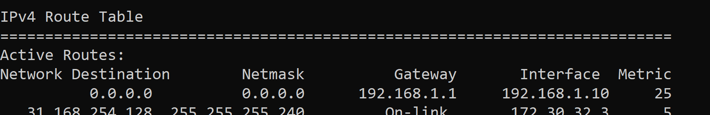
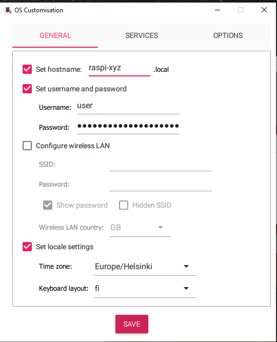

# IoT Security Lab 1: Environment Setup

## 1. Ethical hacking

The purpose of the setup is to provide an environment where hacking tools can be tried and tested freely. **Remember that using the tools in other networks leads either to attempted access to information system or interference of information network, which are both criminal offences!**

## 2. Introduction

The complete setup for security labs is as follows (detailed setup steps come later):


- In the diagram **green** networks and components indicate the domain where you are allowed to use kali tools. **Red indicates start of no go zone**. You should familiarize yourself to IP ranges in use, so that you can confidently identify to which network your devices are connected to (note that IP addresses within networks will be from DHCP, so your setup might not have exactly same IP addresses for each device).
  - You will set up an **EdgeRouterX** (ERX) device to create `your_LAN` where you can attach your wired devices.
  - You will configure **RaspberryPi 4** as
    1. WiFi access point to create `your_WiFi` where ESP32 can connect to
    2. Router to provide network access to WiFi connected devices
    3. Platform to run mqtt broker and other IoT stack containers. Note that in this setup each container has its own IP address and it behaves like a separate device in your_LAN.
- As the victim system, you will set up
  - ESP32 to connect to `your_WiFi` and to send MQTT data
  - Raspi with IoT stack client to collect and visualize ESP32 data

## 3. Setting up EdgeRouter X

### 3a. Factory reset

The devices are in unknown configuration state. Because there is no permanent management port to the device, you need to perform factory reset.

- Disconnect power supply.
- Push down the reset pin (No excessive force is required. You can use a LED or resistor component wire for this.)
- While reset button is pushed down, connect the power supply. Keep reset down.
- The device leds turn on and off one by one.
- When last LED turns on, release the reset button
  - If you release the button too early, you have a normal reset with old configuration
  - If you release the button too late, you end up in test mode where the leds blink in two groups.

After the factory reset, the management view can be accessed from **eth0 port at address 192.168.1.1/24** after the device has booted. It is an embedded linux device, and the boot takes about 1-2 minutes.  
You need to set up a static IP address for your computer to get in same subnet (192.168.1.10 will do fine). Open the management view with browser. Default user/password is **ubnt/ubnt**

### 3b. Configuration


You can use the setup wizard (Basic Setup). **Note that the wizard only shows intended future, the shown settings have no connection to current setup!!!** You aim to configure - switch that connects LAN ports together - default LAN is 192.168.1.0/24 - DHCP service for LAN connected devices so that they get automatical IP addresses - router that provides a gateway to internet (WAN) - WAN is all other addresses than LAN addresses - router that applies NAT (network address translation) from LAN private addresses to WAN side address - firewall that blocks outside traffic coming into your LAN - firewall that blocks your port scans from accidentally reaching embedded lab network

**WAN Configuration**

Because you are so ~~lazy~~ efficient, you choose eth4 as WLAN port

> otherwise you will need to move the computer cable away from eth0 after configuration, because in the new configuration eth0 would be WAN port expecting to get a DHCP IP from that network, and because your laptop does run DHCP server, there will be no IPs and no connection.

Default firewall will protect your network from evil fellow students.


**LAN Configuration**

No separate DNS service, so use servers provided by embedded lab network.

LAN devices are connected to ports eth0-eth3, and they will get DHCP IP addresses from set range (your laptop's currently set static IP is already in this range, so you could keep it, but it is best practice to switch to automatic IP after the new configuration is up and running).


**Users configuration**

Depending on the ERX firmware version you were already prompted to change the password. Remember basic security rule: **Do not use default passwords**.


**Reboot**

To restart the router, click Apply button and necessary confirmations. After the restart the router is in new configuration.

### 3c. Firewall settings

From your networks `your_LAN` and `your_WIFI` you will want to browse internet (HTTP and HTTPS protocols to ports 80 and 443), you need to get DNS working to map URLs to IP addresses (port 53).

Packets to any other port is dropped.

0. Open firewall settings


1. Add Ruleset: WAN_OUT
2. For WAN_OUT, Actions: Edit ruleset; add interface


3. Add allow rule for outgoing http to port 80


4. Add similar rules for https (port 443 tcp) and dns (port 53, allow both udp and tcp)

### 3d. Testing the router / firewall setup

1. Switch to automatical IP for your laptop ethernet interface. After disconnecting + connecting the ethernet cable back to ERX router, you should get IP address like 192.168.1.38 (that is the first IP in DHCP pool). On Windows command prompt, the command is `ipconfig`. This shows that DHCP server works OK and devices connected to LAN get IP addresses.

2. Next lets check ERX routing and NAT. For the testing it is necessary that your data packets are sent via ERX. If you have wireless connection open, then you have multiple routes to internet from your laptop. It is not a problem, remeber that you can check how many routes with netmask `0.0.0.0` you have. On Windows command prompt, the command is `route print`.

If there are multiple routes to internet, then Windows chooses the route with lowest metric. Typically ethernet metric is lower than wifi metric. Make sure gateway 192.168.1.1 (ERX) is either the only route or has lowest metric.



As the ip packets are routed via erx, then

- Try `ping 1.1.1.1`, it should timeout (Your outwards firewall rules should block it).
- Try opening normal web browser session to some page. It should open because 1) DNS translates URL to IP address, 2) traffic to 443 and 80 ports is allowed.

## 4. Setting up Raspberry Pi 4

### 4.1 Embedded Lab procedure

RasPi 4 devices are in use by other course as well. So after each session, detach the sd card and keep it until next lab.

### 4.2 Set up Raspi OS

Install 64-bit RaspiOS to sd card using Raspberry Pi Imager application https://www.raspberrypi.com/software/

Select target device, OS and your sd card device


Choose "Edit settings"


**General** tab: Set hostname, username, password and locale. No need for WiFi settings.
**Services**: Enable SSH




...and flash the device.

### 4.3 Boot RasPi

Insert SD card to Raspi and connect power. We'll be using SSH shell to connect to raspi ( if any connection troubles, you can connect display and keyboard as well, usually that is not needed).

Connect RasPi and your laptop top EdgerouterX LAN sockets (eth1-eth3 for sure, plus either eth0 or eth4 depending on your erx setup)

On windows command line

```
C:\>ssh jpp@raspi-105.local
The authenticity of host 'raspi-105.local (10.99.32.105)' can't be established.
ED25519 key fingerprint is SHA256:QYeBz3gjViqs9ukPbKs1BfG4ezgPtdwYu+wNhe+hWAE.
This key is not known by any other names.
Are you sure you want to continue connecting (yes/no/[fingerprint])? yes
Warning: Permanently added 'raspi-105.local' (ED25519) to the list of known hosts.
jpp@raspi-105.local's password:
Linux raspi105 6.6.74+rpt-rpi-v8 #1 SMP PREEMPT Debian 1:6.6.74-1+rpt1 (2025-01-27) aarch64

The programs included with the Debian GNU/Linux system are free software;
the exact distribution terms for each program are described in the
individual files in /usr/share/doc/*/copyright.

Debian GNU/Linux comes with ABSOLUTELY NO WARRANTY, to the extent
permitted by applicable law.
Last login: Sun Mar  9 22:28:10 2025 from 10.99.10.149
jpp@raspi:~ $
```

## 4.4 Set up Raspi WiFi access point

I recommend running the following commands in Raspi console one by one so that you can react to any potential problems in setup.

```
sudo apt install -y hostapd
sudo systemctl stop hostapd

# choose your SSID so that you can recognise your network
sudo nmcli con add type wifi ifname wlan0 mode ap ssid RASPI-105
nmcli con show
sudo nmcli con modify wifi-wlan0 ipv4.addresses 192.168.99.10/24
sudo nmcli con modify wifi-wlan0 ipv4.method shared
sudo nmcli con modify wifi-wlan0 wifi-sec.key-mgmt wpa-psk

# for future fun, choose 8-digit numeric password (nice to crack)
sudo nmcli con modify wifi-wlan0 wifi-sec.psk "11223344"
sudo nmcli con modify wifi-wlan0 wifi.band bg
sudo nmcli con modify wifi-wlan0 wifi.channel 6
sudo nmcli con modify wifi-wlan0 wifi-sec.proto rsn
sudo nmcli con modify wifi-wlan0 wifi-sec.pairwise ccmp
sudo nmcli con modify wifi-wlan0 wifi-sec.group ccmp

sudo nmcli con down wifi-wlan0
sudo nmcli con up wifi-wlan0
```

Use a phone (Network Analyzer app or similar) to verify that your raspi has created a wifi network, you can connect to it and can have network access.

## 4.5 Set up IoT stack

Next you set up MQTT broker and other containers on raspi.

> Note that we are aiming at a specific setup where each container has a separate IP. In that setup Raspi host cannot directly send data to its containers, but traffic must pass through the network switch, which is very convenient for testing man-in-the-middle attacks.
> So for example case raspi pinging one of its containers: The ping request exits raspi eth0 port to erx switch, the switch sends the packets back the same cable towards container MAC address to physical eth0 port where it is bridged to the container. The ping reply will travel similarly.
> If you disconnect the raspi ethernet cable, then pinging the containers is not possible.

**Install IoT stack**

Following the instructions for add-on installation in https://sensorsiot.github.io/IOTstack/Basic_setup/

```
jpp@raspi:~ $ curl -fsSL https://raw.githubusercontent.com/SensorsIot/IOTstack/master/install.sh | bash
```

After automated reboot, run the script again until you get line `install.sh completed`
The script will install docker and other required tools.

**Configure the stack**

```
jpp@raspi:~ $ cd IOTstack
jpp@raspi:~/IOTstack $ ./menu.sh
```

Seelect `Build Stack`
Choose mosquitto, nodered, grafana and influxdb (for nodered you need to build separate configuration)

Next create a docker macvlan network, in order to have a separate IP address for each container.

```
jpp@raspi:~/IOTstack $ nano docker-compose.yml
```

```
networks:
  macvlan_net:
    driver: macvlan
    driver_opts:
      parent: eth0  # Replace with your actual physical interface name
    ipam:
      config:
        - subnet: 192.168.1.0/24  # Change this to match your local network
          gateway: 192.168.1.1     # Set your actual gateway
          ip_range: 192.168.1.128/28  # Define an IP range for your containers .128-.132
#  default:
#    driver: bridge
#    ipam:
#      driver: default
#  nextcloud:
#    driver: bridge
#    internal: true
#    ipam:
#      driver: default

```

at the end of each of the four containers definition, add the lines below to connect that container to macvlan created above

```
    networks:
    - macvlan_net
```

Build the containers

```
jpp@raspi:~/IOTstack $ docker-compose up -d
```

...this will take a while, so you can leave it to build and continue to kali VM installation... continue from here when that is completed

...after the build is ready, you can verify that all containers are running, and query what are their ip addresses, and try to ping another container (note that in your setup the IPs might not be exactly same):

```
jpp@raspi:~/IOTstack $ docker ps
jpp@raspi:~/IOTstack $ docker exec -it mosquitto ip a
jpp@raspi:~/IOTstack $ docker exec -it mosquitto ping 192.168.1.131
```

Even though the containers are up and running, you can not ping them from raspi: macvlan has that feature that isolates the network from host. you need to add a route to containers and add one dummy interface with IP to macvlan network, so that raspi host is a member in it as well:

```
jpp@raspi:~/IOTstack $ sudo ip route add 192.168.1.128/28 via 192.168.1.1 dev eth0
jpp@raspi:~/IOTstack $ sudo ip link add macvlan0 link eth0 type macvlan mode bridge
jpp@raspi:~/IOTstack $ sudo ip addr add 192.168.1.200/24 dev macvlan0
jpp@raspi:~/IOTstack $ sudo ip link set macvlan0 up
```

Now you should be able to ping the containers 192.168.1.128 - 192.168.1.131 from raspi

```
jpp@raspi:~/IOTstack $ ping 192.168.1.128
```

# 5 Kali VM

## 5.1 Install Kali VM

Get and install prebuilt vm https://www.kali.org/docs/virtualization/import-premade-virtualbox/
Make vm have **bridged connection** to your LAN.
Boot vm and make sure you have connection to internet via ERX.

```
# check connection to ERX management IP == gateway IP
ping 192.168.1.1
# you cannot ping through firewall (firewall drops everything except dns,http,https)
# so instead get google page to check that dns works and http works
wget www.google.com
cat index.html
# should see some html + messy looking javascript from google
```

Upgrade packets: Open a terminal

```
kali@kalivm:~ $ sudo apt update
kali@kalivm:~ $ sudo apt upgrade
```

## 5.2 Install OpenVAS

OpenVAS is a tool for vulnerability scanning. In kali vm

```
kali@kalivm:~ $ sudo apt install openvas
kali@kalivm:~ $ sudo gvm-setup
# at this point make a copy of the admin password!!!
kali@kalivm:~ $ sudo gvm-check-setup
```

Then in kali web browser (Firefox) open https://localhost:9293
Go to tab `Administration / Feed Status` and wait... it takes some hours until vulnerability database feeds have completed.

# 6 ESP32

## 6.1 Setup

1. Start with mqtt tcp example.
2. Configure the project to connect to your wifi using your password.
3. Configure the project to connect to your mqtt broker `mqtt://192.168.1.129` (check IP in your system: from raspi cmdline `docker exec -it mosquitto ip a`)
4. Modify the code to send continuous data packets, for example by adding this to end of `mqtt_app_start`

```
    while(1)
    {
        vTaskDelay(100);
        esp_mqtt_client_publish(client, "/topic/qos0", "data", 0, 0, 0);
    }
```

5. Build-flash-monitor
6. You should be able to see the packets from kali vm that is connected to `your_lan`

```
mosquitto_sub -h 192.168.1.129 -t "#" -v
```

This will ask you install the necessary `mosquitto-clients` package if not installed yet. In the command - `-h` sets the broker IP - `-t "#"` subscribes to all topics - `-v` sets verbose mode so that both topic name and message are dispalyed

You should now have almost complete setup as shown in the diagram at the top of these instructions. Kali Wifi setup will require external wifi dongle.
