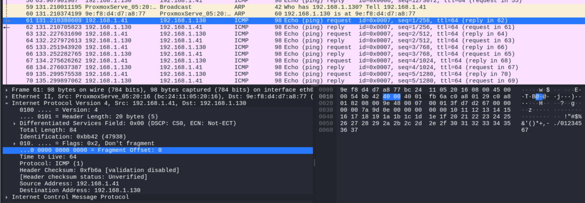
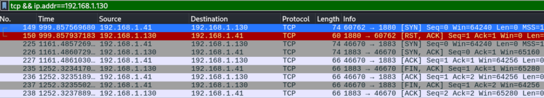

# Lab 2a: Networks and protocols

The goal of the first lab assignment is to get familiar with your target system setup and wireshark tool. This is not an actual cybersecurity scenario.

**Setup**: Have the Lab1 setup up and running (ESP32 publishes MQTT messages to raspi broker)

## 1. IP addresses and ARP

Ref lecture 2 material, each device has an ARP table that maps learned IP addresses to MAC addresses within LAN. In kali you see the table with commands

```
kali@kalivm:~ $ arp -a
kali@kalivm:~ $ ip n
```

And in Windows

```
c:\> arp -a
```

Log into raspberrypi and check what are neighbour MACs it has learned.
In raspberrypi, open a terminal into mosquitto container and check what are its learned neighbour MACs. (Use `docker exec -it <containername> <clicommand>` )
Save results to to your repo as `arp_tables.md`

## 2. IP packet capture

### 2a. using wireshark

Wireshark tool has two filters:

1. You can apply **capture filter** when you choose the network interface to connect to. This is useful when there is a lot of traffic to be inspected. Maybe that is not our use case.
2. **Display filter** cleans up your screen. This is very useful.

So for example to catch the sequence started when pinging a target: ARP + ping. Ping is one of message types in ICMP protocol, so in kali

1. start wireshark
2. choose eth0 interface
3. apply display filter `arp || icmp`
4. in kali terminal clear the arp table: `sudo ip -s neigh flush all`
5. in kali terminal check that arp table is empty: `arp -a`
6. start/restart wireshark capture to get rid of possible other captures (sharkfin button top left in wireshark window)
7. in kali terminal `ping -c2 192.168.1.130` to send two pings

You should get capture where your kali vm sends broadcast arp request to find out the MAC for IP 192.168.1.130, and sends ping i.e. an ethernet frame (containing IP packet (containing ICMP ping message)) to that MAC address.
Clicking on individual capture lines will update the decoded message windows below capture lines.



To capture TCP packets for a TCP connection

1. apply display filter `tcp && ip.addr==192.168.1.130`
2. start/restart wireshark capture to get rid of possible other captures (sharkfin button top left in wireshark window)
3. in kali terminal run netcat `nc 192.168.1.130 1880` to start TCP handshake on port 1880 (in my system I am running mosquitto at 192.168.1.130, so no service at that port --> RST,ACK reply)
4. in kali terminal run netcat again with service port that is open (check your container IPs) `nc 192.168.1.130 1883`
5. Stop the connection with ctrl-C
   You should see a capture with TCP handshake and TCP teardown sequences.



Sending a SYN packet to TCP port reveals whether there is a service running at that port. This is used in port scanning (just sending the SYN packet and checking the response, but not continuing the sequence)

Select TCP SYN packet line, right-click and choose "Copy Bytes as Hex Dump" and paste to your repo document `tcp-syn-packet.md`

### 2b. using tcpdump

Tcpdump is a command line tool that does packet capture. It doesn,t require GUI, so you can run it in for example raspberrypi containers.

Typically containers have very limited set of programs so you need to install those into the container. There are two ways of doing this: 1. You modify the `Dockerfiles` that define what is in the container so that necessary packages are installed, and you rebuild the container images and restart the container. 2. You add the packages to running container. **Remember** that when container is restarted, all those installed packets disappear, because container image is not changed, only the runtime container.

Install and run tcpdump in mosquitto container (in Alpine Linux you use `apk` packet manager, not `apt` as in RasPi):

```
jpp@raspberrypi:~ $ docker exec -it mosquitto /bin/ash
/ # apk add tcpdump
fetch http://dl-cdn.alpinelinux.org/alpine/v3.21/main/aarch64/APKINDEX.tar.gz
fetch http://dl-cdn.alpinelinux.org/alpine/v3.21/community/aarch64/APKINDEX.tar.gz
(1/2) Installing libpcap (1.10.5-r0)
(2/2) Installing tcpdump (4.99.5-r0)
Executing busybox-1.37.0-r12.trigger
OK: 11 MiB in 26 packages
/ # tcpdump -i eth0 port 1883 -A
tcpdump: verbose output suppressed, use -v[v]... for full protocol decode
listening on eth0, link-type EN10MB (Ethernet), snapshot length 262144 bytes

...

14 packets captured
14 packets received by filter
0 packets dropped by kernel
/ # exit

```

When you have installed the packet to currently running container, you can run again

```
jpp@raspberrypi:~ $ docker exec -it mosquitto tcpdump -i eth0 port 1883 -A
```

Save one captured MQTT message from mosquitto container to your repo as `mqtt-capture.md`

## 3. Network switch

ERX device combines network switch functionality with router functionality. The switch function connects LAN ports eth0-eth3 together, and router function provides WAN (eth4) NAT routing to LAN side.

Network switch has arp tables too, it learns the MAC addresses of the devices connected to its ports ("port" as the physical connector eth0-eth4, this has nothing to do with TCP ports). After learning the devices, it only sends data frames to that port where the destination device is connected.

--> using wireshark on your kali linux (connected to say eth2) you can not see the traffic between devices connected to eth1 and eth3.

**Network switch** functionality is always **implemented with hardware** that forwards the learned packets at line speed. The forwarded packets do not appear outside the hardware component and are not visible for example to ERX software. So it is not possible log into erx and tcpdump data from switch ports. If you need to see switch data, you can use switch mirror functionality that forwards all packets from selected port to mirror port as well. You can connect a device to that port and you can study all those packets. We will not apply that procedure in these labs.

The **router** functionality in ERX is **implemented with linux network stack software**, so it is possible to run tcpdump on WAN connector (eth4), if needed.
