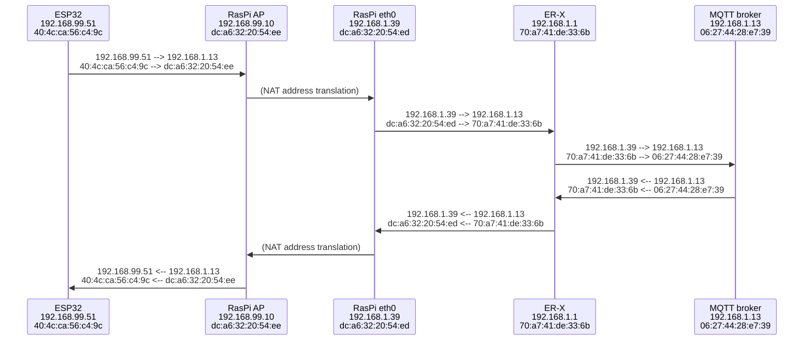

# Normal MQTT Flow

```mermaid
sequenceDiagram
participant ESP32 as ESP32 <br> 192.168.99.51 <br> 40:4c:ca:56:c4:9c
participant RaspiAP as RasPi AP <br> 192.168.99.10 <br> dc:a6:32:20:54:ee
participant Raspi as RasPi eth0 <br> 192.168.1.39 <br> dc:a6:32:20:54:ed
participant ERX as ER-X <br> 192.168.1.1 <br> 70:a7:41:de:33:6b
participant broker as MQTT broker <br> 192.168.1.13 <br> 06:27:44:28:e7:39

ESP32 ->> RaspiAP: 192.168.99.51 --> 192.168.1.13 <br> 40:4c:ca:56:c4:9c --> dc:a6:32:20:54:ee
RaspiAP ->> Raspi: (NAT address translation)
Raspi ->> ERX: 192.168.1.39 --> 192.168.1.13 <br> dc:a6:32:20:54:ed --> 70:a7:41:de:33:6b
ERX ->> broker: 192.168.1.39 --> 192.168.1.13 <br> 70:a7:41:de:33:6b --> 06:27:44:28:e7:39

broker ->> ERX: 192.168.1.39 <-- 192.168.1.13 <br> 70:a7:41:de:33:6b <-- 06:27:44:28:e7:39
ERX ->> Raspi: 192.168.1.39 <-- 192.168.1.13 <br> dc:a6:32:20:54:ed <-- 70:a7:41:de:33:6b
Raspi ->> RaspiAP: (NAT address translation)
RaspiAP ->> ESP32: 192.168.99.51 <-- 192.168.1.13 <br> 40:4c:ca:56:c4:9c <-- dc:a6:32:20:54:ee
```
